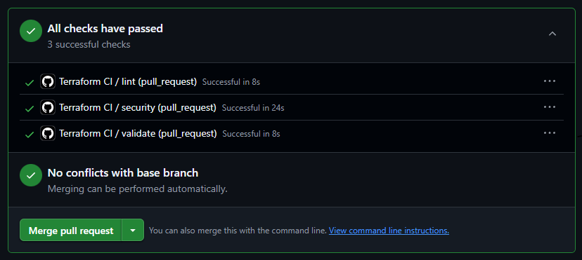
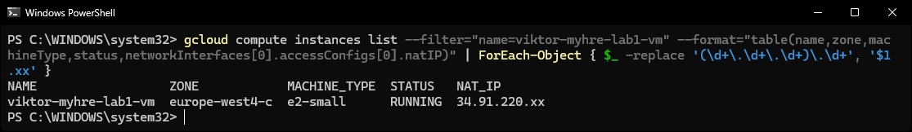

# Lab 1 --- Terraform + GCP

## Overview

The purpose of this lab is to provision a Linux virtual machine in
Google Cloud Platform using Terraform. All infrastructure is defined as
code (Infrastructure as Code) and version controlled in a GitHub
repository.

The project deploys a VM in GCP together with basic security hardening
and a simple backup strategy. The repository also includes a GitHub
Actions pipeline that validates the Terraform configuration on every
push or pull request.

------------------------------------------------------------------------

## Infrastructure

The Terraform configuration provisions the following resources in GCP:

-   Compute Engine VM
-   External IP address
-   Startup script for basic system hardening
-   Snapshot policy for backups

The VM runs **Ubuntu 22.04 LTS**.

------------------------------------------------------------------------

## Repository structure

    lab1-terraform/
    ├── main.tf
    ├── variables.tf
    ├── outputs.tf
    ├── terraform.tfvars
    ├── startup.sh
    ├── screenshots/
    │   ├── pipeline.png
    │   └── gcp-vm.png
    └── .github/
        └── workflows/
            └── terraform.yml

Short description of the files:

-   **main.tf** --- defines the infrastructure (VM and snapshot policy)
-   **variables.tf** --- variables for project, region and student identifier
-   **outputs.tf** --- values printed after deployment
-   **startup.sh** --- script executed when the VM starts
-   **terraform.yml** --- GitHub Actions pipeline configuration

------------------------------------------------------------------------

## Prerequisites

To run this project locally you need:

-   Terraform installed
-   gcloud CLI installed
-   Access to a GCP project
-   A GCP service account credential (GCP_SA_KEY)
-   Git

------------------------------------------------------------------------

## Configuration

Create a file called `terraform.tfvars`.

Example:

    project_id = "your-project-id"
    region     = "europe-north1"
    student_id = "your-name"

This file is ignored by Git and should not be committed because it
contains local configuration values.

------------------------------------------------------------------------

## Running Terraform

Initialize Terraform:

    terraform init

Validate the configuration:

    terraform validate

Preview the changes Terraform will make:

    terraform plan

Apply the configuration and create the resources in GCP:

    terraform apply

After deployment Terraform outputs information such as:

-   VM name
-   external IP address
-   zone

------------------------------------------------------------------------

## CI Pipeline

The repository includes a GitHub Actions pipeline that runs on every
push or pull request.

The pipeline performs three checks.

### Formatting check

Ensures the Terraform code is correctly formatted.

    terraform fmt -check

### Security scan

Uses **Trivy** to scan the Terraform configuration for potential
security issues.

### Validation

    terraform init -backend=false
    terraform validate

This ensures that the configuration is syntactically correct before
deployment.

------------------------------------------------------------------------

## Basic security configuration

The VM is configured using a startup script.

### UFW

The firewall is configured so that:

-   all incoming traffic is blocked by default
-   outgoing traffic is allowed
-   SSH access is allowed

This reduces the attack surface of the machine.

### Fail2ban

Fail2ban is installed to help protect the server against SSH brute‑force
attacks.

### Automatic security updates

`unattended-upgrades` is installed so that security updates are applied
automatically.

------------------------------------------------------------------------

## Backup

A snapshot policy is attached to the VM disk.

The policy:

-   creates daily snapshots
-   retains snapshots for 7 days

This makes it possible to restore the disk in case of failure or data
loss.

------------------------------------------------------------------------

## Screenshots

### Pipeline

Example run of the GitHub Actions pipeline where all steps pass.

### VM in GCP

The deployed VM shown in the GCP console.

